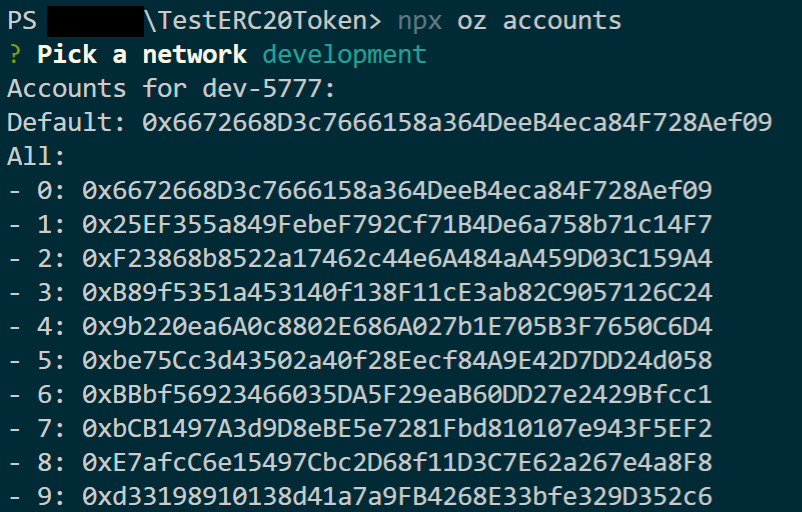
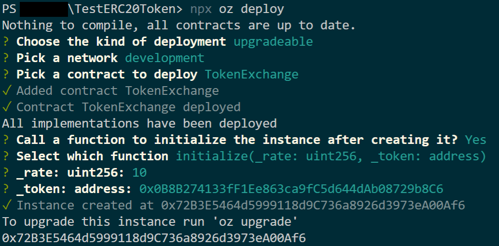

# ERC20-OZ-SDK
We will learn how to deploy an ERC20 smart contract using the [OpenZeppelin SDK](https://github.com/OpenZeppelin/openzeppelin-sdk). We will also write a `TokenExchange` contract, that will allow any user to purchase an ERC20 token in exchange for ETH, at a fixed exchange rate. We will write the `TokenExchange` smart contract ourselves, but leverage the [ERC20 implementation](https://docs.openzeppelin.com/contracts/3.x/erc20) from [OpenZeppelin contracts](https://docs.openzeppelin.com/contracts/3.x/).

## Install
First, install [Node.js](http://nodejs.org/) and [npm](https://npmjs.com/). Then, install the OpenZeppelin SDK (globally) running:

```
npm install -g @openzeppelin/cli
```

> If you get an `EACCESS permission denied` error while installing, please refer to the [npm documentation on global installs permission errors](https://docs.npmjs.com/resolving-eacces-permissions-errors-when-installing-packages-globally). Alternatively, you may run `sudo npm install --unsafe-perm --global @openzeppelin/cli`, but this is highly discouraged, and you should rather either use a node version manager or manually change npm's default directory.

## Setup
I recommend using the OpenZeppelin SDK through the `openzeppelin SDK` command line interface.

To start, create a directory for the project and access it:

```
mkdir TestERC20Token
cd TestERC20Token
```

Use `npm` to create a `package.json` file:

```
npm init -y
```

And initialize the OpenZeppelin SDK project:

```
npx oz init
```

Now it is possible to use `npx openzeppelin deploy` to create instances for these contracts that 
later can be upgraded, and many more things.

Run `npx openzeppelin --help` for more details about thes and all the other functions of the
OpenZeppelin CLI.

## ERC20 Smart Contract
We will first get ourselves an ERC20 token. Instead of coding one from scratch, we will use the one provided by the [OpenZeppelin Contracts Ethereum Package](https://github.com/OpenZeppelin/openzeppelin-contracts-ethereum-package). An Ethereum Package is a set of contracts set up to be easily included in an OpenZeppelin project, with the added bonus that the contracts' code *is already deployed in the Ethereum network*. This is a more secure code distribution mechanism, and also helps you save gas upon deployment.

To link the OpenZeppelin Contracts Ethereum Package into your project, simply run the following:
```
npx oz link @openzeppelin/contracts-ethereum-package
```

This command will download the Ethereum Package (bundled as a regular npm package), and connect it to your OpenZeppelin project. We now have all of OpenZeppelin contracts at our disposal, so let’s create an ERC20 token!
> Make sure you install `@openzeppelin/contracts-ethereum-package` and not the vanilla `@openzeppelin/contracts`. The latter is set up for general usage, while `@openzeppelin/contracts-ethereum-package` is tailored for being used with [OpenZeppelin Upgrades](https://docs.openzeppelin.com/upgrades/2.8/). This means that its contracts are [already set up to be upgradeable](https://docs.openzeppelin.com/upgrades/2.8/writing-upgradeable#use-upgradeable-packages).

Let’s deploy an ERC20 token contract to our `development` network. Make sure to have a [Ganache](https://www.trufflesuite.com/ganache) instance running, or start one by running:

```
 npx ganache-cli --deterministic
```
For setting up the token, we will be using the [ERC20PresetMinterPauser](https://github.com/OpenZeppelin/openzeppelin-contracts-ethereum-package/blob/master/contracts/presets/ERC20PresetMinterPauser.sol) implementation provided by the OpenZeppelin package. We will *initialize* the instance with the token metadata (name, symbol), and then mint a large initial supply for one of our accounts.

Check the RPC server for your Ganache environment and adjust the correct port in the `network.js` file.
> Usually you have to adjust the port from 8545 to 7545.


Let’s break down what we did in the command above. We first chose to create an instance of the `ERC20PresetMinterPauserUpgradeSafe` contract from the `@openzeppelin/contracts-ethereum-package` package we had linked before, and to create it in the local `development` network. We are then instructing the CLI to *initialize* it with the initial values needed to set up our token. This requires us to choose the appropriate `initialize` function, and input all the required arguments. The OpenZeppelin CLI will then atomically deploy and initialize the new instance in a single transaction.

We now have a working ERC20 token contract in our `development` network.

Next we get the accounts we have setup



Then we mint 100 TERC20 to our default account


> The standard ERC20 smart contract has 18 decimals, i.e. 1 token = 10^18.

We can check that the initial supply was properly allocated by using the `balance` command. Make sure to use the address where your ERC20 token instance was created.


Great! We can now write an exchange contract and connect it to this token when we deploy it.

## Token Exchange Smart Contract
In order to transfer an amount of tokens every time it receives ETH, our exchange contract will need to store the token contract address and the exchange rate in its state. We will set these two values during initialization, when we deploy the instance with `npx oz deploy`.

Because we’re writing upgradeable contracts we cannot use [Solidity constructors](https://docs.openzeppelin.com/upgrades/2.8/proxies#the-constructor-caveat). Instead, we need to use *initializers*. An initializer is just a regular Solidity function, with an additional check to ensure that it can be called only once.

To make coding initializers easy, [OpenZeppelin Upgrades](https://docs.openzeppelin.com/upgrades/2.8/) provides a base `Initializable` contract, that includes an `initializer` modifier that takes care of this. You will first need to install it:

```
npm i @openzeppelin/upgrades
```
Now, let’s write our exchange contract in `contracts/TokenExchange.sol`, using an *initializer* to set its initial state:


> Solidity 0.6.8 introduces SPDX license identifiers so developers can specify the [license](https://spdx.org/licenses/) the contract uses. E.g. OpenZeppelin Contracts use the MIT license. SPDX license identifiers should be added to the top of contract files. The following identifier should be added to the top of your contract (example uses MIT license):
```
// SPDX-License-Identifier: MIT
```

Note the usage of the `initializer` modifier in the `initialize` method. This guarantees that once we have deployed our contract, no one can call into that function again to alter the token or the rate.

Let’s now create and initialize our new `TokenExchange` contract:


> For Visual Studio Code users, if you get an `File import callback not supported` error due to the imported packages, consider adding the following to your VS Code settings:
```
"solidity.packageDefaultDependenciesContractsDirectory": "",
"solidity.packageDefaultDependenciesDirectory": "node_modules"
```

Our exchange is almost ready! We only need to fund it, so it can send tokens to purchasers. Let’s do that using the `npx oz send-tx` command, to transfer the full token balance from our own account to the exchange contract. Make sure to replace the recipient of the transfer with the `TokenExchange` address you got from the previous command.


All set! We can start playing with our brand new token exchange.

## Using Our Exchange
Now that we have initialized our exchange contract and seeded it with funds, we can test it out by purchasing tokens. Our exchange contract will send tokens back automatically when we send ETH to it, so let’s test it by using the `npx oz transfer` command. This command allows us to send funds to any address; in this case, we will use it to send ETH to our `TokenExchange` instance:


> Make sure you replace the receiver account with the corresponding address where your `TokenExchange` was created.

We can now use `npx oz balance` again, to check the token balance of the address that made the purchase. Since we sent 0.1 ETH, and we used a 1:10 exchange rate, we should see a balance of 1 TERC20 (TestERC20Token).


Success! We have our exchange up and running, gathering ETH in exchange for our tokens.
## Summary
We have built a more complex setup in this tutorial, and learned several concepts along the way. We introduced [Ethereum Packages](https://blog.openzeppelin.com/open-source-collaboration-in-the-blockchain-era-evm-packages/) as dependencies for our projects, allowing us to spin up a new token with little effort.